## Leisurely-Cloud enhanced fork

Fork of [HRuiCcc/RuiC-card-skill](https://github.com/HRuiCcc/RuiC-card-skill), retaining its MIT license and attribution.

Adds themed back artwork with exact browser typography and angle-dependent foil; independent relief depth controls; polished responsive viewer controls and configurable branding. Also fixes coincident transparent text planes, download requests, and verification with an absent effects layer. See [backs and relief](references/backs-and-relief.md). A fresh pipeline build and all 33 browser checks passed.

---

# ✦ RuiC Card Skill

**English** | [中文](README.md)

> A **universal Agent Skill** — no host lock-in, and **any multimodal model can run it**: it recreates, in the browser, the kind of holographic card that used to shimmer in the window of the stationery shop down the street.
> Say one sentence and you get a 3D holographic card page that shifts colour as you turn it and has real layered depth, plus a Blender project you can edit however you like.

The cards you couldn't afford as a kid — now you can print anyone you want on them. This is your private card workshop.

**It is a fully automatic holographic-card production line**: you give one sentence or one reference image, and the model takes care of the rest —

1. **Draw four layers**: subject, background, line art and typography, all on one canvas in one shared coordinate system
2. **Build the 3D scene**: Blender creates the card geometry and pushes the four layers apart in space by depth — the subject bulging forward, the background receding
3. **Lay down the holographic material**: the rainbow phase follows your viewing angle, so it shimmers wherever you turn it; four finishes — foil, silver, pearl and original art
4. **Assemble the page**: the Three.js viewer is bundled into a single file, served locally, then opened and tested for real — drag, flip, sliders, phone layout
5. **Deliver**: the page link + the `card.blend` source project + four transparent layer PNGs + `card-config.json` + renders

The tech stack is just three things: **Blender** (official portable build, auto-installed, never touches your system environment) + **Three.js** (the material rebuilt from the same UV formulas) + a **Python pipeline** (one step from finished artwork to served page). The skill itself is only code and text — install it and go. The artwork, projects and models you generate stay in your own project directory.

---

## 🎬 Demo

### Before · layers spread apart

The initial layer spacing: subject, effects and typography sat further apart and visibly "fanned out" as the card turned:


[▶ Watch the full before video](assets/demo-before.mp4)

Demo rendered with **DeepSeek V4.1 Flash**.

### After · tighter spacing (current default)

Tightened by one notch: the layers sit closer together and the card reads as one object, while keeping the layered depth — this is the current out-of-the-box default:


[▶ Watch the full after video](assets/demo-after.mp4)

Demo rendered with **DeepSeek V4.1 Flash**.

---

## ✨ Features

- **One sentence to a card**: description or reference image → layers → config → pipeline → page, fully automatic. All you do is imagine it
- **No host lock-in, no model lock-in**: tied to no vendor — the pipeline needs the model to draw the four layers itself and to open rendered frames and judge them, so **any multimodal model** (one that can produce images and look at them) works with any harness that reads `SKILL.md`
- **Real 3D layered depth**: the subject bulges forward, the background recedes, and the layers shift against each other with the viewing angle — not one flat texture
- **View-dependent shimmer**: the rainbow phase follows the viewing angle and shimmers wherever you turn it; four card finishes — foil, silver, pearl and original art
- **Play with it in the browser**: drag to rotate, flip to the back, sliders for depth / gloss / aspect ratio, and it adapts to phone portrait and landscape (the viewer's own UI labels are Chinese — 画面比例 / 画面景深 / 特效景深 / 底纹景深 and so on)
- **Verification built in**: `node scripts/verify_web.mjs <project>` starts its own headless browser and its own local server, then walks through drag, flip, zoom, keyboard, all five sliders, the four finishes, screenshot download, a 390 px narrow viewport and reduced motion — comparing **real captured frames**, not just whether a slider readout changed — and writes its report and screenshots to `verification/`. Runs on macOS, Windows and Linux, and works in GUI-less containers and as root
- **No Blender install needed**: the official portable build is downloaded, SHA-256 verified and unpacked into the project directory, leaving your system environment untouched
- **Zero external requests from the page**: the viewer is bundled into a single file (three + icons all inlined), so ad blockers have nothing to block; and even with browser hardware acceleration off, a CSS-3D layered fallback means you never get a white screen
- **Editable delivery**: a real `card.blend` project + transparent layer PNGs + `card-config.json`. Change whichever layer you want
- **Text-only skill**: nothing but code and text, packaged as a one-click ZIP for sharing — no binaries, no credentials, no caches

---

## 🚀 Quick start

### Installation

The skill itself is `SKILL.md` + Markdown + plain Python/Node scripts. It is **bound to no particular host and no particular model** — as long as the host can read `SKILL.md` and runs a **multimodal model** (one that can generate images and inspect them), drop it into the host's skills directory and it works (the directory name is the skill name; the common convention is `~/.agents/skills/`, other hosts use their own skills directory).

### Requirements

- A **multimodal** model — it has to generate the layer artwork and look at rendered frames to judge them; a text-only model cannot do either
- Python **3.9+** with Pillow (`ensure_blender.py` uses `Path.is_relative_to`, which fails outright on 3.6 / 3.8)
- Node.js + npm
- **Blender does not need to be installed** — the pipeline fetches the official portable build into `<project>/tools/` and verifies its SHA-256 automatically. If the official source is blocked on your network, point `RUIC_BLENDER_BASE` at a mirror (for example `RUIC_BLENDER_BASE=https://mirrors.aliyun.com/blender/Blender4.5/`); the checksum comes from the same source, so only use a mirror you trust
- The verification script needs a Chromium-family browser: a system-installed Chrome / Edge / Chromium works, as does the Chromium in the Playwright cache, and you can point at a specific one with `RUIC_BROWSER` or `--browser`. **GUI-less Linux (including root / containers) works out of the box** — on Linux the script adds `--no-sandbox --disable-dev-shm-usage` by itself

### Say the word

> "Use RuiC-card-skill to make me an ink-wash koi holographic card, calligraphy type, No.001"

Or upload a reference image:

> "Make a card from this image, keep the character and the composition, swap the background for a starry sky"

It will read the card spec back to you first, then get to work: draw the four layers → generate the typography layer → write the config → run the pipeline → start the local server → open the page and test drag, flip, sliders and phone layout for real → deliver.

### What you get

| Item | What it's for |
|---|---|
| Local page link (`127.0.0.1:4173`) | Drag, rotate, flip, pull the sliders |
| `card.blend` | Keep tuning materials, relight and render in Blender |
| `assets/` layered images | Swap any layer and re-run the pipeline |
| `card-config.json` | Change the name, edition number, rarity |
| Renders | Post them straight away |
| `verification/` | The automated verification report plus screenshots from every angle — proof the card really drags and flips |

---

## 🎬 What you can make with it

- **A legend card for the cat**: upload a photo and add "legendary rarity, gold border", drag it, and the cat bulges forward while the background falls away
- **An indie game card set**: one character, one description — warrior, mage, rogue, boss, batch-produced, one config per card
- **A team keepsake card**: avatar as the subject, department colour as the background, the slogan as the type layer; send the link round and everyone flips it all afternoon
- **Holiday ritual**: write one line on the back; the moment they flip to it, the shimmer hits full strength
- **Launch-day easter egg**: one link for the product card — "scan it, it's the kind that shimmers" — and the audience spins it on the spot
- **A material playground**: in `card.blend` the laser, stars and glowing line art are all independently adjustable nodes; open it to learn how the shimmer is built

---

## ⚙️ How it works

One sentence in, one shimmering card out, through a fully automatic pipeline:

```mermaid
flowchart LR
    A[One sentence / reference image] -->|"layer prompts<br>art-direction"| B[Four layers<br>subject·background·lineart·text]
    B --> C[card-config.json<br>card spec]
    C --> D[run_pipeline.py<br>one-command pipeline]
    D -->|"validate_assets<br>alpha / alignment check"| E{Checks pass?}
    E -->|"no, regenerate"| B
    E -->|yes| F[Portable Blender<br>auto-install + SHA-256]
    F --> G[card.blend<br>editable parallax scene]
    G --> H[card.glb<br>geometry + material-name contract]
    H --> I[web-template<br>single-file Three.js viewer]
    I --> J["localhost:4173<br>drag / flip / sliders / phone layout"]
```



The load-bearing parts:

- **All four layers share one UV formula**: subject, background, line art and typography are composited by the same formula in Blender and in the browser — what you see is what you get
- **Parallax is not a simple offset texture**: the viewing direction is transformed into the card plane, divided by a bounded normal component, and applied as a signed depth offset in UV — that is what makes the layers genuinely shift against each other
- **The holographic phase follows the viewing angle**: it shimmers wherever you turn it, instead of just cycling with time
- **glTF cannot carry node graphs**: Blender's custom material graphs do not survive glTF export, so the browser rebuilds the shader from the same formulas and bundles it into a single file — per-module requests get caught by ad blockers, a single file cannot be
- **Blender lives inside the project**: the official portable build is SHA-256 verified and unpacked into `<project>/tools/`, so each project carries its own environment and they never interfere

---

## 🔧 The knobs

The pipeline ships with a set of sensible defaults, and leaves a door open on all of them:

- **Parallax strength**: subject defaults to scale 1.25 / depth 0.4, background depth −0.25; push them up for a more "popping" card
- **Effects layer**: the optional `assets/effects.png` with its own depth (`effectsDepth`, the 「特效景深」 slider in the page), stacked above the subject and below the typography — good for petals, sparks, thorns and similar decoration
- **Card frame and typography**: all in `text.png`. The page applies no parallax to the text layer, so a border stays nailed to the card edge
- **Laser stripes**: stripe density, distortion and angle, plus the pink → yellow → blue → white ramp
- **Glowing line art**: strength and mask density, from a faint outline to a neon edge
- **Stars**: Voronoi scale plus animated noise, from a few specks to a full sky
- **Blender interface language**: Simplified Chinese by default, stored in the project's local config, one word to change

---

## 📁 Layout

```
RuiC-card-skill/
├── SKILL.md                    # the "operating manual" the host reads
├── references/
│   ├── art-direction.md        # how to prompt the layers, reference-image handling
│   ├── config.example.json     # example card config
│   └── verification.md         # pre-delivery verification checklist
├── scripts/
│   ├── ensure_blender.py       # fetch the official portable Blender
│   ├── build_card.py           # build the editable Blender scene
│   ├── export_web.py           # export the card geometry
│   ├── generate_typography.py  # accurate transparent typography
│   ├── validate_assets.py      # layer checks (auto-converts checkerboard fake alpha)
│   ├── checkerboard_to_alpha.py # deterministic checkerboard → alpha (with regression tests)
│   ├── run_pipeline.py         # the one-command pipeline
│   └── package_skill.py        # package the text-only skill into a shareable ZIP
└── assets/
    └── web-template/           # the responsive Three.js viewer
```

The skill itself is only code and text, so it stays light. The artwork, `.blend` files and models you generate live in your own output project.

---

## 📦 Packaging and sharing

To send it to a friend or put it in a repository:

```bash
python scripts/package_skill.py RuiC-card-skill --out ~/Desktop/RuiC-card-skill.zip
```

It packages text files only, against an allowlist, so the ZIP comes out clean and ready to use.

---

## Support

<div align="center">
  
  <p><strong>Scan with WeChat to support this project</strong></p>
</div>
